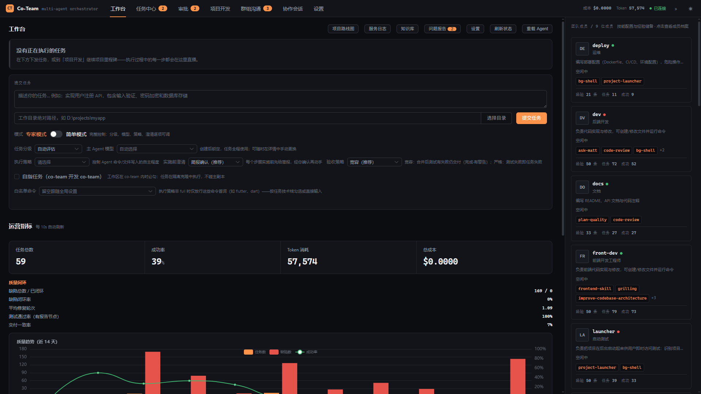
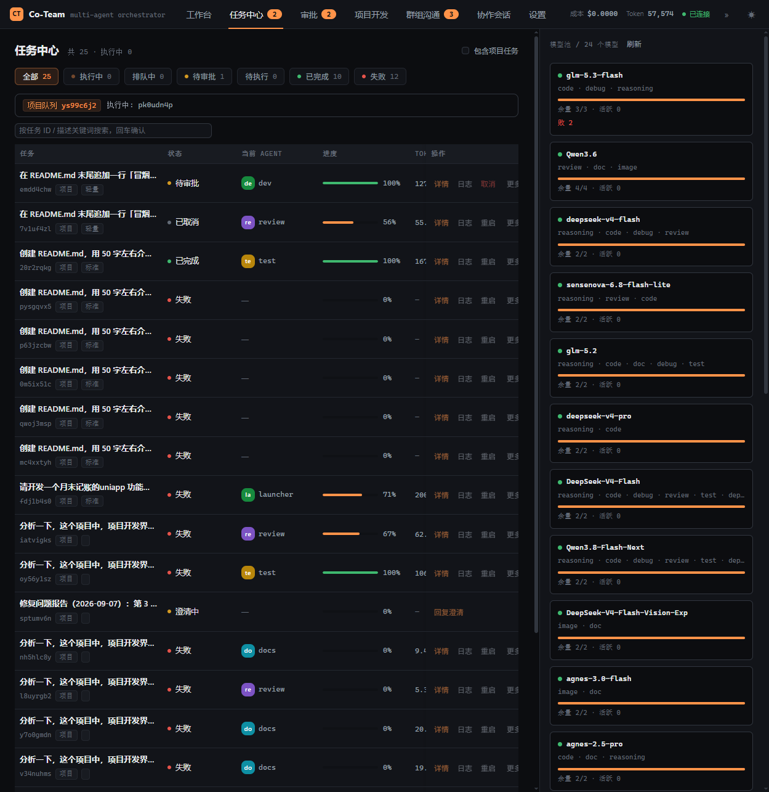
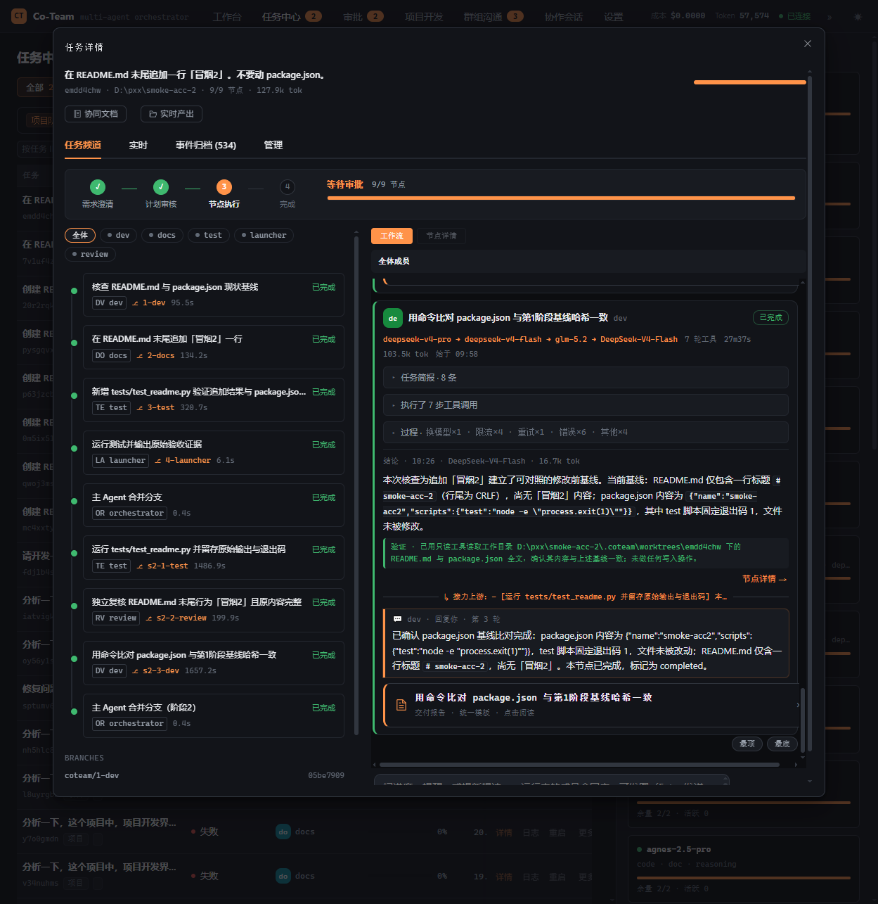
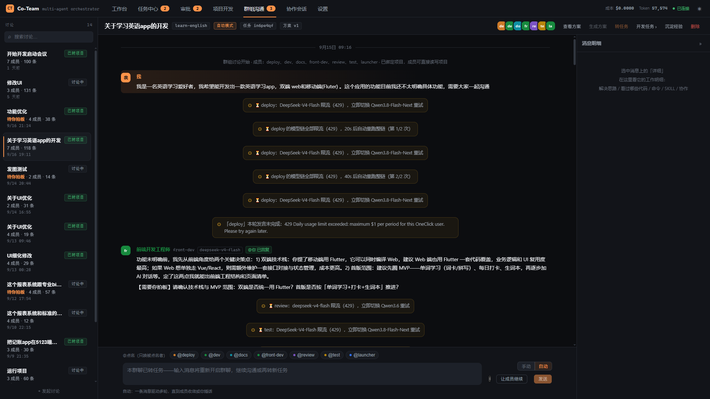
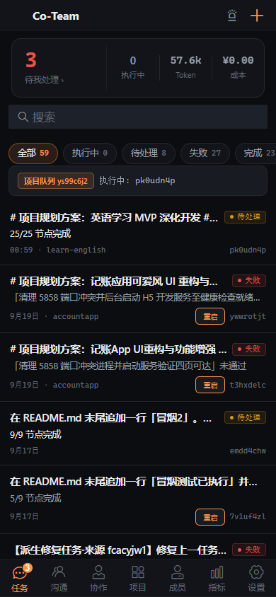
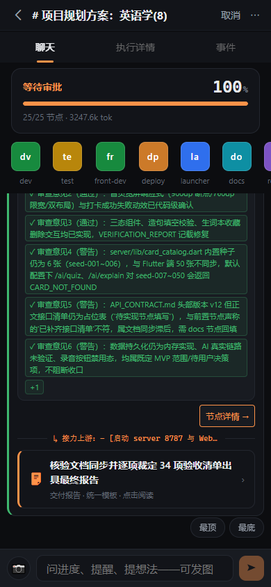
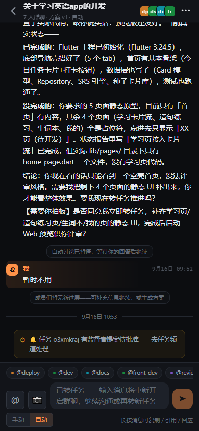

# Co-Team

> 面向个人开发者的多智能体协作开发助手

提一个需求，Co-Team 自动拆解任务、分发给专业 Agent 团队执行，全过程实时可见，产出自动交付。单机自托管，接入任意 OpenAI 兼容模型即可运行。

## 核心特点

- **完整任务管线**：需求澄清 → 滚动阶段规划（DAG）→ 连续调度并行执行 → 节点交付成果 → 测试失败自动修复闭环 → Git 分支提交 → 合并后机器验收（平台探测 + 清单机审），失败可派生修复任务
- **9 个专业 Agent**：dev（后端/通用）、front-dev（前端）、test、review、refactor、docs、deploy、launcher（后台启动项目供访问）、partner（协作会话主 Agent「搭档」），亦可自定义
- **三种协作形态**：
  - **任务编排**：多 Agent 按 DAG 协同，支持插话介入、实时问答（ask/answer）、监督者催办与提案
  - **群组讨论**：多 Agent 自由讨论打磨方案，支持 @ 点名、群内工具执行与小改代码，一键转项目开发任务（两段式确认）
  - **协作会话**：与「搭档」1 对 1 结对开发，直接读写工作区、执行命令、收发图片，可召唤项目内其他 Agent 协同，消息排队/打断、快照回滚
- **模型池**：按服务接入点分组管理多模型，降级链、健康冷却、限流容量退避、按复杂度成本选型、原生 function calling 工具通道
- **上下文引擎**：token 估算校准、四级水位线裁剪（snip/elide/折叠/413 分型）、任务便签 scratchpad、RAG 知识混合检索、SKILL.md 技能系统（索引 + 按需加载）
- **安全可控**：任务级沙箱 + Git 分支工作流、目录监狱、六级命令权限（plan_only → unrestricted）、假完成三重闸（幻觉阻塞证据门 / 产物核查 / 合并验收）、自指任务克隆隔离
- **实时可视化**：Web 仪表盘 + 独立移动端（挂载 `/m/`），生成打字机直播、节点心跳卡（模型/token/限流退避可见）、审批收件箱、交付成果卡片、项目进度成果表
- **经验沉淀**：知识库（四类记忆）+ 任务终局 LLM 复盘 + Dream 每日整理线程 + 缺陷转修复任务，越用越懂你的项目
- **通知与集成**：Webhook / 飞书（出站通知 + bot 入站命令）、外部 MCP 服务接入（stdio/HTTP，per-agent 白名单）

## 界面预览

### Web 端

| 工作台 | 任务中心 |
|---|---|
|  |  |

| 作战室（工作会话卡） | 群组沟通 |
|---|---|
|  |  |

### 移动端（挂载于 `/m/`）

| 任务列表 | 作战室 | 群聊详情 |
|---|---|---|
|  |  |  |

## 快速开始

### 环境要求

- Node.js >= 18、npm
- Redis（可选，用于跨重启持久化；缺失时自动使用落盘内存总线）
- 至少一个 OpenAI 兼容的模型服务（本地 vLLM / Ollama 或云端 API 均可）

### 安装与启动

```bash
git clone https://github.com/parr2017/co-team.git
cd co-team
npm install
npm run build
npm start          # 服务端，默认端口 8855
```

访问 http://localhost:8855 使用 Web 仪表盘；手机与电脑同 WiFi 时访问 `http://<局域网IP>:8855/m/` 使用移动端。

### 配置

```bash
cp .env.example .env                        # 填入模型服务的 API Key
cp config/config.example.yaml config/config.yaml   # 配置模型池与其他参数
```

`config.yaml` 核心配置节：`dashboard`（端口/Token 门禁）、`model_pool`（模型与服务接入点）、`orchestrator`、`llm`、`context`、`discussion`、`knowledge`、`permissions`、`mcp`、`feishu`——每项均有中文注释。

开发模式（热重载）：

```bash
npm run dev:server   # 服务端 8855
npm run dev:web      # Web 开发服务器 8856
npm run dev:mobile   # 移动端开发服务器 8857
```

### CLI

```bash
npx coteam-cli init ./my-project --name "My Project" --description "项目描述"
```

生成标准项目脚手架（目录结构 + README/CONTRIBUTING/ARCHITECTURE 三文档 + git 初始提交）。

## 功能导览

| 形态 | 入口 | 说明 |
|------|------|------|
| 任务编排 | 任务中心 → 发起任务 | 支持任务分级（轻量/标准/重量）、需求澄清、计划审核、执行中插话、作战室实时跟踪、审批/取消/续跑 |
| 群组讨论 | 群组沟通 | 勾选 Agent 发起讨论，@ 点名、方案收敛、一键转项目开发任务 |
| 协作会话 | 协作 | 与「搭档」结对开发，支持模型钉选、排队/打断、发图、diff 查看、快照回滚 |
| 审批收件箱 | 审批 | 聚合并一键处理：节点审批、监督者提案、待批命令、提问待答 |
| 项目管理 | 项目 | 脚手架建项目、进度监控、项目简报（AI 生成+人工编辑）、进度成果表 |
| 设置 | 设置 | 模型池（服务分组编辑/上游拉取）、命令权限、技能库、MCP 服务、Agent 管理 |

## 技术栈

- **服务端**：Node.js + TypeScript · [Hono](https://hono.dev/) · OpenAI SDK · ws（WebSocket）· ioredis（可选）· simple-git · Model Context Protocol SDK
- **Web 前端**：Vue 3 · Element Plus · Vue Router · ECharts · marked · highlight.js · Vite
- **移动端**：Vue 3 · Vant · Vue Router · Vite（与桌面端零代码共享，仅共用后端 API）
- **测试**：Vitest（92 个测试文件 / 683 用例）
- 运行期无 Python 依赖（`legacy-python/` 仅为早期版本存档）

## 项目结构

```
co-team/
├── agents/            # Agent 定义（agent.yaml + prompt.md + handler + skills）
├── skills/            # 全局技能库（SKILL.md：frontmatter + 正文）
├── server/            # 后端服务
│   └── src/
│       ├── orchestrator/   # 编排引擎（调度/规划/监督者/验收）
│       ├── api/            # REST API
│       ├── convo.ts        # 协作会话引擎
│       ├── discussion.ts   # 群组讨论引擎
│       ├── llm.ts          # LLM 传输层（流式/watchdog/超时语义）
│       ├── scheduler.ts    # 模型池调度（降级/冷却/容量退避）
│       ├── sandbox.ts      # 沙箱与权限（目录监狱/命令白名单）
│       ├── tools.ts        # Agent 工具系统（文件/命令/检查点/视觉/MCP）
│       ├── knowledge.ts    # 知识库与记忆
│       ├── skills.ts       # 技能装载
│       ├── mcp/            # 外部 MCP 客户端
│       └── feishu/         # 飞书 bot
├── web/               # Web 仪表盘（Vue3 + Element Plus）
├── mobile/            # 独立移动端（Vue3 + Vant，挂载 /m/）
├── config/            # 配置示例
├── docs/              # 设计/计划文档（plans/）与界面截图（screenshots/）
├── scripts/           # 运维脚本（e2e-demo 等）
└── legacy-python/     # Python 早期版本存档（不参与运行）
```

## 环境变量

在 `.env` 中配置（不要提交真实值；`config/config.yaml` 含密钥，已被 .gitignore 覆盖）：

| 变量 | 用途 |
|------|------|
| `DEEPSEEK_API_KEY` 等模型服务 Key | 按实际接入的模型服务填写，与 `model_pool` 条目对应 |
| `COTEAM_WEBHOOK` | 任务事件通知 Webhook 地址 |
| `COTEAM_FEISHU_WEBHOOK` | 飞书群机器人 Webhook（出站通知） |
| `COTEAM_FEISHU_APP_ID` / `COTEAM_FEISHU_APP_SECRET` | 飞书自建应用凭据（bot 入站） |
| `COTEAM_FEISHU_ENCRYPT_KEY` / `COTEAM_FEISHU_VERIFICATION_TOKEN` | 飞书事件订阅校验 |
| `COTEAM_STATE_FILE` | 内存总线持久化文件路径（无 Redis 时） |
| `COTEAM_LOG_DIR` / `COTEAM_LOG_LEVEL` | 日志目录与级别 |
| `COTEAM_MOBILE_DIST` / `COTEAM_WEB_DIST` | 前端构建产物目录（默认自动探测） |
| `COTEAM_LLM_NATIVE_TOOLS` / `COTEAM_LLM_STREAM` / `COTEAM_LLM_TIMEOUT_MS` | LLM 传输层进阶开关（默认值见 config 注释） |

完整变量说明见 `.env.example` 与 `config/config.example.yaml` 中的注释。

## 安全说明

- 沙箱为**目录级隔离**（任务副本 / git worktree + 分支工作流），不含 CPU/内存/网络的容器级强隔离，请勿在敏感环境运行不可信代码
- 目录监狱：命令中的越界绝对路径一律拒绝；文件读写限制在项目目录内
- 命令权限六级：`plan_only` / `readonly` / `approve_required` / `whitelist_auto` / `full` / `unrestricted`
- 对外暴露服务前，建议在 `config.yaml` 的 `dashboard.token` 配置 API Token 门禁（启用后所有 `/api` 请求需 Bearer Token）
- 自指任务（用 Co-Team 开发 Co-Team）强制隔离到独立克隆执行，主仓库零触碰

## API

REST + WebSocket 事件推送（`/ws/events`）双通道，核心端点：

```
POST /api/tasks                创建任务       GET  /api/tasks?q=           任务搜索
POST /api/tasks/:id/execute    执行任务       POST /api/tasks/:id/intervene 执行中介入
POST /api/convos               协作会话       POST /api/discussions        群组讨论
GET  /api/metrics              运行指标       GET  /api/projects/:id/report 项目成果表
PUT  /api/config/model-pool    模型池管理     POST /api/config/mcp/test    MCP 连通性探测
```

## 测试

```bash
npm test        # server 全量 vitest
```

## 路线图

- [x] 多 Agent 任务编排 / 滚动规划 / 并行调度
- [x] 群组讨论引擎 / 协作会话 / 监督者 / 实时问答
- [x] 上下文引擎 / RAG 知识库 / 技能系统 / 经验沉淀
- [x] Web 仪表盘 / 独立移动端 / 飞书 bot / MCP 接入
- [ ] 插件市场
- [ ] 容器级强隔离沙箱（Docker/gVisor）
- [ ] npm / PyPI 正式发布
- [ ] iOS / Android 原生打包
- [ ] 多人共享任务视图

## 许可证

[MIT](LICENSE)
