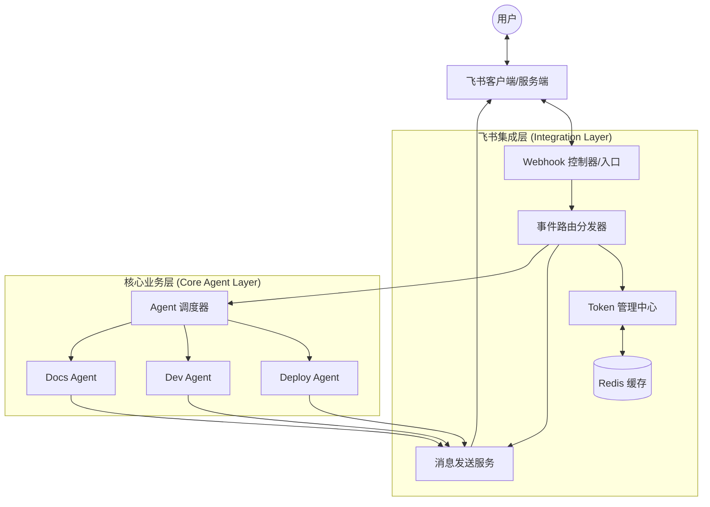

# 飞书接入整体技术架构方案

## 1. 目标与愿景
将本项目现有的 Agent 能力（部署、开发、文档、重构等）集成至飞书平台，实现通过飞书聊天界面直接驱动 Agent 执行任务，并实时接收执行状态通知。 

## 2. 总体架构图 (逻辑流)

## 3. 核心组件设计

### 3.1 Token 管理中心 (`TokenManager`)
- **职责**：负责 `tenant_access_token` 的获取、存储与自动刷新。
- **实现机制**：
    - 使用 Redis 存储 Token，Key 为 `feishu:tenant_token`。
    - 设置过期时间为 7100 秒（略早于飞书的 2 小时有效期）。
    - 请求 API 前先检查缓存，若失效则调用 `/auth/v3/tenant_access_token/internal` 更新。

### 3.2 Webhook 控制器 (`WebhookController`)
- **职责**：作为飞书事件的唯一入口，处理所有入站请求。
- **关键流程**：
    1. **URL 验证**：识别 `challenge` 类型请求并原样返回，完成应用激活。
    2. **签名校验**：通过 `X-Lark-Signature` 对 Payload 进行 HMAC-SHA256 校验，拦截非法请求。
    3. **异步处理**：接收到事件后立即返回 HTTP 200，将具体逻辑交给消息队列或异步任务处理，避免飞书服务端超时重试。

### 3.3 事件路由分发器 (`EventRouter`)
- **职责**：解析飞书事件类型（如 `im.message.receive_v1`），将其映射到具体的 Agent 指令。
- **指令映射示例**：
    - `/deploy [env]` $
ightarrow$ 触发 `Deploy Agent`
    - `/docs [topic]` $
ightarrow$ 触发 `Docs Agent`
    - `@机器人 [问题]` $
ightarrow$ 触发通用咨询/分析逻辑

### 3.4 消息发送服务 (`MessageService`)
- **职责**：封装飞书 API，提供统一的消息推送接口。
- **能力支持**：
    - **文本消息**：用于简单的状态确认。
    - **富文本/卡片消息**：使用 `Card Builder` 构建交互式界面（如：任务进度条、执行结果详情、确认按钮）。
    - **动态更新**：通过 `card_id` 在 Agent 执行过程中实时更新同一条消息的状态，避免刷屏。

## 4. 数据流转分析

### 场景：用户请求部署 $
ightarrow$ Agent 执行 $
ightarrow$ 结果反馈
1. **触发**：用户在飞书群发送 `/deploy production` $
ightarrow$ 飞书推送 Webhook 到 `WebhookController`。
2. **解析**：`EventRouter` 解析出指令为 `Deploy`，参数为 `production`。
3. **执行**：`AgentDispatcher` 调用 `Deploy Agent` 开始工作。
4. **反馈 (中间态)**：`Deploy Agent` 通过 `MessageService` 发送一条卡片消息：“🚀 正在启动生产环境部署...”，并记录 `card_id`。
5. **更新 (完成态)**：部署完成后，`Deploy Agent` 调用 `MessageService` 更新该 `card_id` 的内容为：“✅ 部署成功！查看日志 [链接]”。

## 5. 非功能性设计

### 5.1 安全性
- **凭证管理**：`App ID` 和 `App Secret` 存储在 `.env` 或环境变量中，禁止提交至 Git。
- **请求校验**：所有入站 Webhook 必须经过签名验证。

### 5.2 可靠性与性能
- **削峰填谷**：引入轻量级队列（如 Redis List 或 RabbitMQ）处理高频事件推送，防止后端压力过大导致 API 限流。
- **指数退避重试**：在调用飞书 API 遇到 `429 Too Many Requests` 时，采用指数退避算法进行重试。

### 5.3 可扩展性
- **插件化 Agent**：通过配置映射表（Mapping Table）增加新 Agent，无需修改核心路由逻辑。