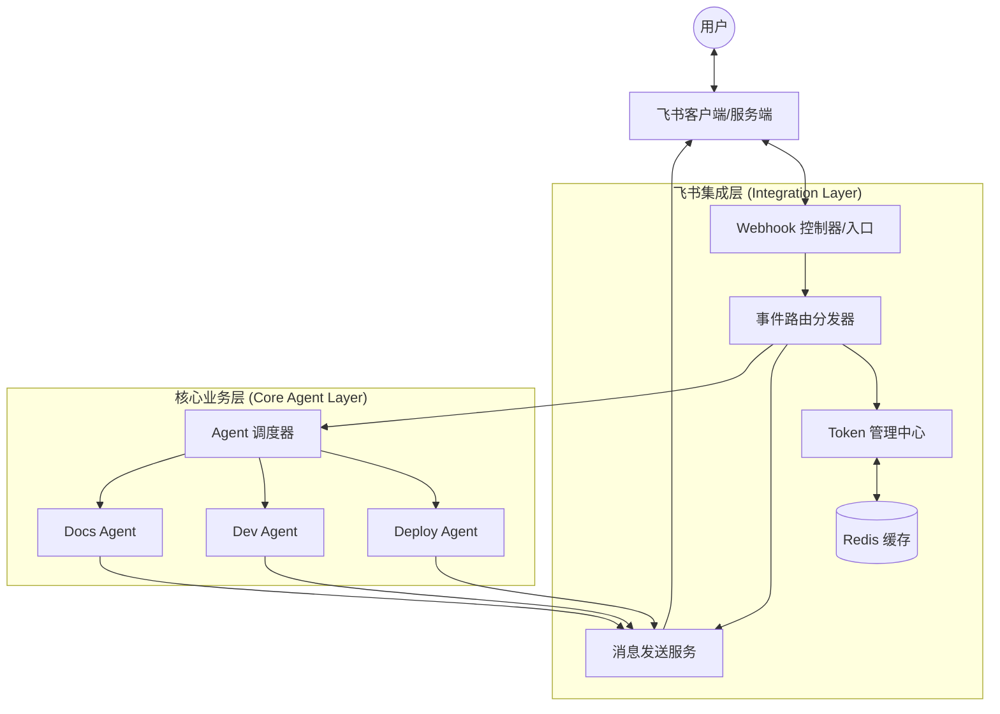

# 飞书接入整体技术架构方案

## 1. 目标与愿景
将本项目现有的 Agent 能力（部署、开发、文档、重构等）集成至飞书平台，实现通过飞书聊天界面直接驱动 Agent 执行任务，并实时接收执行状态通知。 

## 2. 总体架构图 (逻辑流)

## 3. 核心组件设计

### 3.1 Token 管理中心 (`TokenManager`)
- **职责**：负责 `tenant_access_token` 的获取、存储与自动刷新。
- **实现机制**：
    - 使用 Redis 存储 Token，Key 为 `feishu:tenant_token`。
    - 设置过期时间为 7100 秒（略早于飞书的 2 小时有效期）。
    - 请求 API 前先检查缓存，若失效则调用 `/auth/v3/tenant_access_token/internal` 更新。

### 3.2 Webhook 控制器 (`WebhookController`)
- **职责**：作为飞书事件的唯一入口，处理所有入站请求。
- **关键流程**：
    1. **URL 验证**：识别 `challenge` 类型请求并原样返回，完成应用激活。
    2. **签名校验**：通过 `X-Lark-Signature` 对 Payload 进行 HMAC-SHA256 校验，拦截非法请求。
    3. **异步处理**：接收到事件后立即返回 HTTP 200，将具体逻辑交给消息队列或异步任务处理，避免飞书服务端超时重试。

### 3.3 事件路由分发器 (`EventRouter`)
- **职责**：解析飞书事件类型（如 `im.message.receive_v1`），将其映射到具体的 Agent 指令。
- **指令映射示例**：
    - `/deploy [env]` $
ightarrow$ 触发 `Deploy Agent`
    - `/docs [topic]` $
ightarrow$ 触发 `Docs Agent`
    - `@机器人 [问题]` $
ightarrow$ 触发通用咨询/分析逻辑

### 3.4 消息发送服务 (`MessageService`)
- **职责**：封装飞书 API，提供统一的消息推送接口。
- **能力支持**：
    - **文本消息**：用于简单的状态确认。
    - **富文本/卡片消息**：使用 `Card Builder` 构建交互式界面（如：任务进度条、执行结果详情、确认按钮）。
    - **动态更新**：通过 `card_id` 在 Agent 执行过程中实时更新同一条消息的状态，避免刷屏。

## 4. 数据流转分析

### 场景：用户请求部署 $
ightarrow$ Agent 执行 $
ightarrow$ 结果反馈
1. **触发**：用户在飞书群发送 `/deploy production` $
ightarrow$ 飞书推送 Webhook 到 `WebhookController`。
2. **解析**：`EventRouter` 解析出指令为 `Deploy`，参数为 `production`。
3. **执行**：`AgentDispatcher` 调用 `Deploy Agent` 开始工作。
4. **反馈 (中间态)**：`Deploy Agent` 通过 `MessageService` 发送一条卡片消息：“🚀 正在启动生产环境部署...”，并记录 `card_id`。
5. **更新 (完成态)**：部署完成后，`Deploy Agent` 调用 `MessageService` 更新该 `card_id` 的内容为：“✅ 部署成功！查看日志 [链接]”。

## 5. 非功能性设计

### 5.1 安全性
- **凭证管理**：`App ID` 和 `App Secret` 存储在 `.env` 或环境变量中，禁止提交至 Git。
- **请求校验**：所有入站 Webhook 必须经过签名验证。

### 5.2 可靠性与性能
- **削峰填谷**：引入轻量级队列（如 Redis List 或 RabbitMQ）处理高频事件推送，防止后端压力过大导致 API 限流。
- **指数退避重试**：在调用飞书 API 遇到 `429 Too Many Requests` 时，采用指数退避算法进行重试。

### 5.3 可扩展性
- **插件化 Agent**：通过配置映射表（Mapping Table）增加新 Agent，无需修改核心路由逻辑。
---

## 6. 入站通道：HTTP Webhook 与长连接（2026-09-26 增补）

系统支持两条互相独立的入站通道，可共存（`seenEvent` 共享去重防双处理），按部署形态选择：

### 6.1 HTTP Webhook（原有通道）
- 路由 `POST /api/feishu/webhook`（`feishu/webhook.ts`），要求飞书云可达（公网 IP / 内网穿透）。
- 鉴权：`encrypt_key` AES 解密 + 签名校验，或 `verification_token` 比对；两者都未配置时 SEC-P0 拒绝挂载（无鉴权 webhook 禁用）。

### 6.2 长连接网关（`feishu/wsGateway.ts`，无公网部署方案）
- `WSClient` 以**出站** WebSocket 主动连飞书开放平台，事件与卡片回调经同一连接推回，服务器零公网暴露（仅出站 443）。长连接仅支持企业自建应用；开放平台「事件与回调」须切到「使用长连接接收事件」。
- 开关：`config.feishu.ws_enabled`（缺省 false，显式开启）；凭据仍用 `app_id`/`app_secret`，`verification_token`/`encrypt_key` 不需要。
- 事件流：SDK 将 v2 事件拍平后分发 → 网关重包回 `{header, event}` 信封 → 复用 `webhook.ts` 的 `processEvent`（建任务/指令/会话逻辑零重写）→ `seenEvent(event_id)` 去重。

### 6.3 审批交互卡片（`feishu/approvalCards.ts`，随网关启用）
- 订阅 TASK 事件频道，将三类停靠事件渲染为**新版 JSON 2.0** 交互卡片（按钮必须 `behaviors:[{type:"callback",value:{...}}]`；旧版卡片回传在长连接下收不到）：
  - `node_waiting_approval` → 节点审批卡（批准 / 取消任务）
  - `command_pending_approval` → 命令审批卡（每条待批命令一组批准/拒绝，id 取自 `task:pending_commands:*`）
  - `queue_human_gate` → 人工门提示卡（信息 + 取消任务）
- 卡片仅推送到任务绑定的飞书会话（`feishu:card:${taskId}`，@机器人建任务时写入）；面板创建的任务不推。
- 回调处理：`card.action.trigger` → 白名单二次校验 → 复刻审批端点副作用（审批名单+enqueue / cancel+abort+removePending / resolvePendingCommand）→ 卡片原地更新 + journal 审计（操作人 open_id）。回调 3 秒内返回，不等节点续跑。
- **安全**：`config.feishu.approvers`（open_id 白名单，环境变量 `COTEAM_FEISHU_APPROVERS` 逗号分隔）未配置时卡片不渲染按钮，回调侧一并拒绝（防御深度）。

### 6.4 可观测性
- 网关连接状态（connected / reconnecting / failed）暴露在 `GET /api/status` 的 `feishu_ws` 字段，`/status` 指令同步可查；连接失败日志会提示检查凭据与开放平台订阅模式。

---

## 7. v2：决策卡补全与会话桥（2026-09-26）

**决策卡（decisionCards.ts）**：订阅 coteam:notify——agent 阻塞提问（ask_user，表单作答/跳过）、监督者提案（四类，一键批准含派生修复任务）、每日报告三选一裁决、需求澄清问卷（最多 3 轮）、节点开工确认、讨论拍板。notify 载荷只有 id，凭 id 回查 KV 取详情；**表单路由按卡片消息 id 注册**（feishu:route:{message_id}，渲染后写入）——表单回调只可靠携带 form_value 与 open_message_id；监督提案决定/每日裁决逻辑复刻对应 HTTP 端点（api/index.ts:680/1822），写动作全部过 approvers 白名单 + journal 审计。

**通知统一化（notifyBridge.ts）**：白名单 notify 事件（task_success/failed/interrupted/auto_restart/preflight、light_escalated、supervisor_report、agent_user_message、task_model_changed、clarify_timeout）以纯文本推到任务绑定聊天（同类 1h 去重）；生命周期演进仍由绑定卡原地更新负责。

**convo 桥（convoBridge.ts）**：`/convo` 进入会话模式（自动列出并绑定最近活跃会话）；自由文本→sendConvoMessage；agent 终稿（convo_message assistant text）推富文本卡；convo_approval / convo_ask 升级为按钮卡/表单卡（resolveConvoApproval / answerConvoAsk）。

**oc 桥（ocBridge.ts）**：`/oc` 进入 OpenCode 模式（自动绑定 running 实例的活动会话）；自由文本→sendPromptAsync（受理回执→完成推送，waitSessionIdle 30min 上限）；**全局监控所有实例所有会话**——session.idle/session.error 事件驱动完成通知（读末条回复渲染），权限/提问 30s 扫描 pendingAll 推审批卡（answerPermission readonly 可用 / answerQuestion）；噪音阀门 `feishu.oc_watch: all|managed|bound`（默认 all）。

**会话模式（session.mode: task/convo/oc 三态互斥）**：命令按当前模式域解析（模式内短命令 /list /new /switch /model /agent /stop），全局仅 /help /status /exit /reset + 模式入口 /convo /oc；"裸命令看选项（当前项打标、序号缓存进 session.last_list），带参数（序号或名称）才执行"。回复任务卡消息 = 中途插话（webhook.ts 按 feishu:cardmsg:{parent_id} 反查任务，复刻 intervene 端点副作用）。
