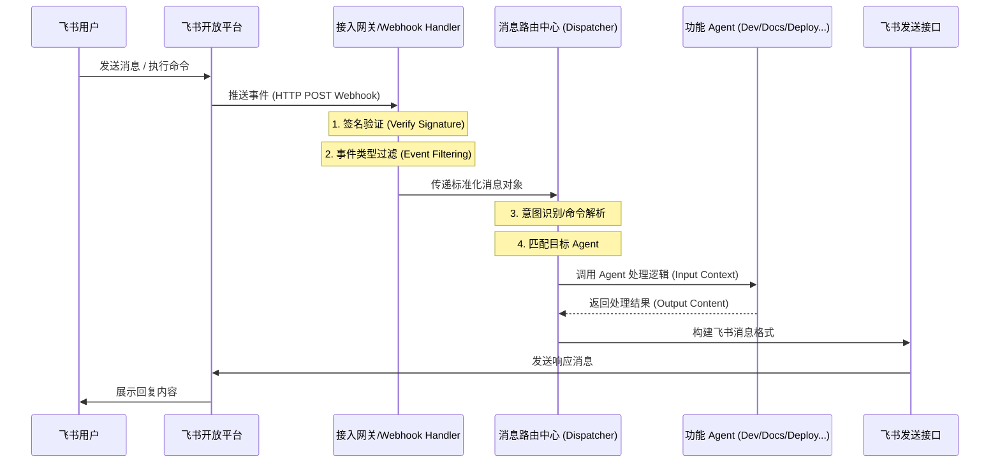

# 飞书用户消息处理与分发流程

本文档详细描述了飞书接入方案中，用户发送的消息如何被系统接收、解析、路由至相应的 Agent 并最终返回响应的完整逻辑流程。

## 1. 整体流程图 (Sequence Diagram)

## 2. 详细步骤解析

### 第一阶段：入站请求 (Inbound Request)
- **触发源**：用户在飞书群聊或私聊中发送文本、点击卡片按钮或输入 `/` 命令。
- **传输机制**：飞书服务器通过配置的 Webhook URL 将事件以 JSON 格式推送至系统网关。
- **关键校验**：
    - **签名验证**：使用 `App Secret` 对请求体进行 HMAC-SHA256 校验，确保请求来自飞书官方。
    - **挑战响应 (Challenge)**：处理飞书在配置 Webhook 时发送的 `url_verification` 请求以完成握手。

### 第二阶段：预处理与标准化 (Pre-processing)
- **事件过滤**：仅处理 `im.message.receive`（接收消息）等相关事件，忽略无关通知。
- **数据清洗**：将飞书特有的 JSON 结构转换为系统内部统一的消息模型（包含：用户ID、会话ID、消息内容、时间戳）。

### 第三阶段：路由与分发 (Routing & Dispatching)
- **意图解析**：
    - **命令模式**：识别 `/` 开头的指令（如 `/docs 搜索接口` $\rightarrow$ 路由至 `Docs Agent`）。
    - **自然语言模式**：通过关键词或 LLM 预判用户需求，决定分发给哪个专业 Agent。
- **上下文加载**：根据会话 ID 从缓存/数据库中检索历史对话记录，构建完整的 Prompt 上下文。

### 第四阶段：Agent 执行 (Execution)
- **任务处理**：选定的 Agent 接收请求 $\rightarrow$ 调用内部工具 (Tools) $\rightarrow$ 生成最终答案。
- **异步处理**：对于耗时较长的任务（如部署、大规模代码分析），Agent 将立即返回“处理中”状态，并在完成后通过异步回调发送结果。

### 第五阶段：出站响应 (Outbound Response)
- **格式转换**：将 Agent 的 Markdown 或纯文本输出转换为飞书支持的 `post` 消息或 `interactive` 卡片格式。
- **接口调用**：调用飞书 `im.message.create` API 将结果推送到原会话中。

## 3. 异常处理流程

| 异常场景 | 处理机制 |
| :--- | :--- |
| **签名验证失败** | 直接返回 HTTP 403，不进入后续逻辑 |
| **路由匹配失败** | 分发至 `Default Agent` 或回复 "抱歉，我没能理解您的指令" |
| **Agent 执行超时** | 网关在 3 秒内先响应飞书服务器（避免重试），随后异步推送结果 |
| **API 限流 (Rate Limit)** | 引入消息队列 (MQ) 进行削峰填谷，确保消息不丢失 |